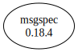

# Third Party Dependencies

<!--[[[fill sbom_sha256()]]]-->
The [SBOM in CycloneDX v1.4 JSON format](https://git.sr.ht/~sthagen/muuntaa/blob/default/sbom/cdx.json) with SHA256 checksum ([e13c67a4 ...](https://git.sr.ht/~sthagen/muuntaa/blob/default/sbom/cdx.json.sha256 "sha256:e13c67a4cbfc68e3b33828f11ffd83f1dea16bea2e058c43053d1cb9d19361ee")).
<!--[[[end]]] (checksum: f37372f4f2a5b24c76fab7005524eda8)-->
## Licenses 

JSON files with complete license info of: [direct dependencies](direct-dependency-licenses.json) | [all dependencies](all-dependency-licenses.json)

### Direct Dependencies

<!--[[[fill direct_dependencies_table()]]]-->
| Name                                        | Version                                            | License     | Author          | Description (from packaging data)                                                                        |
|:--------------------------------------------|:---------------------------------------------------|:------------|:----------------|:---------------------------------------------------------------------------------------------------------|
| [msgspec](https://jcristharif.com/msgspec/) | [0.18.1](https://pypi.org/project/msgspec/0.18.1/) | BSD License | Jim Crist-Harif | A fast serialization and validation library, with builtin support for JSON, MessagePack, YAML, and TOML. |
<!--[[[end]]] (checksum: a8a0d87fd1700f39b83bb37024b28eb0)-->

### Indirect Dependencies

<!--[[[fill indirect_dependencies_table()]]]-->
| Name | Version | License | Author | Description (from packaging data) |
|:-----|:--------|:--------|:-------|:----------------------------------|
<!--[[[end]]] (checksum: 8a87b89207db0be2864af66f9266660c)-->

## Dependency Tree(s)

JSON file with the complete package dependency tree info of: [the full dependency tree](package-dependency-tree.json)

### Rendered SVG

Base graphviz file in dot format: [Trees of the direct dependencies](package-dependency-tree.dot.txt)



### Console Representation

<!--[[[fill dependency_tree_console_text()]]]-->
````console
msgspec==0.18.1
````
<!--[[[end]]] (checksum: 057f57eccbb5e7c445531ff2f2c13336)-->
