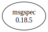

# Third Party Dependencies

<!--[[[fill sbom_sha256()]]]-->
The [SBOM in CycloneDX v1.4 JSON format](https://git.sr.ht/~sthagen/muuntaa/blob/default/sbom/cdx.json) with SHA256 checksum ([aa5850d1 ...](https://git.sr.ht/~sthagen/muuntaa/blob/default/sbom/cdx.json.sha256 "sha256:aa5850d167875fbb5f28a57c2fea2bb07b7bfcab0336880b0b6cea5ca78e71bb")).
<!--[[[end]]] (checksum: 644826c82497b6b63c9c9e82a8138d0d)-->
## Licenses 

JSON files with complete license info of: [direct dependencies](direct-dependency-licenses.json) | [all dependencies](all-dependency-licenses.json)

### Direct Dependencies

<!--[[[fill direct_dependencies_table()]]]-->
| Name                                        | Version                                            | License     | Author          | Description (from packaging data)                                                                        |
|:--------------------------------------------|:---------------------------------------------------|:------------|:----------------|:---------------------------------------------------------------------------------------------------------|
| [msgspec](https://jcristharif.com/msgspec/) | [0.18.4](https://pypi.org/project/msgspec/0.18.4/) | BSD License | Jim Crist-Harif | A fast serialization and validation library, with builtin support for JSON, MessagePack, YAML, and TOML. |
<!--[[[end]]] (checksum: 1c3c9ba0e18c3fac83af659acb8125cc)-->

### Indirect Dependencies

<!--[[[fill indirect_dependencies_table()]]]-->
| Name | Version | License | Author | Description (from packaging data) |
|:-----|:--------|:--------|:-------|:----------------------------------|
<!--[[[end]]] (checksum: 8a87b89207db0be2864af66f9266660c)-->

## Dependency Tree(s)

JSON file with the complete package dependency tree info of: [the full dependency tree](package-dependency-tree.json)

### Rendered SVG

Base graphviz file in dot format: [Trees of the direct dependencies](package-dependency-tree.dot.txt)



### Console Representation

<!--[[[fill dependency_tree_console_text()]]]-->
````console
msgspec==0.18.4
````
<!--[[[end]]] (checksum: 240f24818fc4190703194fc43ca1149d)-->
